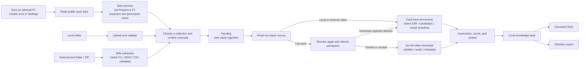

<div align="center">
  <h1>TokBrain</h1>
  <p><strong>Turn Douyin public works you are authorized to process into a searchable, traceable local multimodal knowledge base.</strong></p>
  <p>Link preview / local video / folder and ZIP packages · Keyframes / OCR / ASR · AI summaries · Grounded RAG · Obsidian export</p>
  <p><a href="README.md">简体中文</a> · <strong>English</strong></p>
  <p>
    
    
    
    <a href="LICENSE"></a>
  </p>
</div>

TokBrain is for people who want to reuse knowledge contained in short-form
content instead of merely keeping video files. Regular users can preview public
share links, or select a folder/ZIP of videos already obtained with another tool.
Every successful preview requires an explicit manual confirmation before it enters
Pending, and ingestion remains a separate user action. You can also import a local video. The
same-machine batch API remains available for advanced programmatic integrations.
TokBrain organizes titles, subtitles, speech, on-screen text, and structured
summaries into a local knowledge base.
You can then search it semantically, ask grounded questions, and export notes
to Obsidian.

The UI, SQLite database, index, and derived knowledge stay on your computer.
Link resolution and AI processing require network access. The current release
supports Windows only and is designed for one trusted user on one local
machine.

> Current version: **v1.0.0** (database **schema v9** /
> **API contract 7**)
> Latest release: **v1.0.0** (2026-08-11) · [Read the changelog](CHANGELOG.md) ·
> [View the GitHub Release](https://github.com/fyfsxkh/TokBrain/releases/tag/v1.0.0)

## Feature overview

| Capability | What it does |
|---|---|
| Link preview | Resolves pasted share text and displays per-item results; accepts at most 10 links, then requires manual confirmation and ingestion |
| Local-video import | Selects or drops up to 10 local videos, one work per file, and runs the same multimodal processing path after validation |
| Folder/ZIP package import | Uploads up to 100 videos obtained with another tool and recognizes F2 SQLite, JSON, CSV, and filename metadata without contacting F2 |
| Advanced external batch import | Lets a same-machine tool submit a manifest, upload each video, and commit with a Bearer token; up to 100 items per batch, and not the routine path for regular users |
| Permission-aware resolution | Reads basic metadata and author download permission first; Pending-only submission does not download media or call AI |
| Multimodal processing | Runs speech transcription, keyframe extraction, OCR, summarization, chunking, and embedding on permitted media |
| Restricted-media path | When download is denied or unclear, never downloads the full video or extracts frames; tries subtitles, an independent audio candidate, or metadata |
| Local supplements | Accepts video or image files you are entitled to use and validates their real format before processing |
| Local library | Manages pending, indexed, failed, and archived works with user-created local collections |
| Grounded RAG | Offers fast and deep modes, with answers linked back to local summaries and public sources |
| Summaries and export | Creates structured highlights and exports Markdown plus local images to Obsidian |
| Cost and health controls | Shows local estimates, optional official billing, daily limits, job status, and environment checks |
| Personalization | Includes 13 local themes with adjustable background intensity |

## Screenshots

Every screenshot below uses synthetic data. No real creator content, account,
Cookie, secret, or user data is included.

### Link preview and manual confirmation


The import page makes batch limits, daily usage, resolution status, and the
media policy visible. Link submission runs preview only. After it completes,
you choose a collection and confirm the work into Pending, then start ingestion
explicitly. The Folder/ZIP card follows the same manual confirmation workflow.

<table>
  <tr>
    <td width="50%">
      
    </td>
    <td width="50%">
      
    </td>
  </tr>
  <tr>
    <td align="center"><strong>Local knowledge library</strong><br>States, local collections, summaries, and Obsidian export.</td>
    <td align="center"><strong>Grounded chat</strong><br>Answers over indexed content with visible knowledge sources.</td>
  </tr>
</table>

## From a public work to local knowledge



| Input state | TokBrain behavior | Media retention |
|---|---|---|
| Download explicitly allowed | Runs timed ASR and mixed candidate extraction in parallel, then reranks frames using speech-derived visual needs, OCR, visual descriptions, quality, and timeline coverage | Deletes the temporary full video; retains derived knowledge, final keyframes, and required image assets |
| Download denied or unknown | Never downloads the full video or extracts frames; tries subtitles, an independent audio candidate, and finally basic metadata | Subtitle and audio inputs are temporary and deleted after processing |
| User-supplied local assets | Validates magic bytes, image/video structure, and size before the full local-media path | Retains source assets until the corresponding work is permanently deleted |
| Local-video or integration upload | Validates the real type, video track, size, and duration, then enters the full path without contacting F2 | Retains the source until the corresponding work is permanently deleted |

An in-app link submission performs deduplication and preview only. It never
confirms a work or creates an AI job automatically. TokBrain still applies
the latest permission signal before full processing; if permission changes,
the processing scope is narrowed.

Local-video and integration uploads are validated when stored and need no F2
resolution. Their works use the `never` refresh policy and reuse the retained local
source during ingestion.

> “Author allows download” is only a technical routing signal. It is not
> permission to republish, redistribute, commercialize, train a public model
> on, or otherwise reuse the creator's content.

## Quick start

### Requirements

| Item | Requirement |
|---|---|
| Operating system | Windows; secret protection depends on Windows DPAPI |
| Python | 3.12 |
| Node.js / npm | Node.js 22 or later; npm 10 or later |
| FFmpeg / ffprobe | Required for full-video processing and local-video validation; must be on `PATH` |
| Alibaba Cloud Model Studio API key | Required for OCR, ASR, summaries, embeddings, and chat; not required to resolve links into Pending only |

`setup.cmd` installs project dependencies; it does not install system software
such as Python or Node.js. Before the first run, install **64-bit Python 3.12**
and **Node.js 22 or later**. Select `Add python.exe to PATH` in the Python
installer. If a prerequisite is missing or incompatible, the setup window now
shows the relevant download address and instructions.

### Download and run

```powershell
git clone https://github.com/fyfsxkh/TokBrain.git
cd TokBrain
.\setup.cmd
.\start.cmd
```

If you use GitHub's **Download ZIP**, extract it, open PowerShell in the project
directory, and run the last two commands. A first-time user can also
double-click `setup.cmd`; it applies an execution-policy override only to that
installer process. After setup, you can use:

- `setup.cmd` to install or update dependencies
- `启动.cmd` to start
- `停止.cmd` to stop
- `重启.cmd` to restart

All three entry points share `data/runtime.json`. Start removes a stale state
only after the recorded/current ports are confirmed idle. Stop supports legacy
launcher state, but terminates a legacy process only when its recorded PID,
listening port, and TokBrain service fingerprint all match. Restart reuses the
same stop-then-start path and never kills an unrelated process by port alone.

When ready, TokBrain opens <http://127.0.0.1:3000>; the frontend always listens
on local port 3000. The backend reads `APP_HOST` / `APP_PORT` from `.env`
(default `127.0.0.1:8000`). Run `setup.cmd` again after changing either value so
the production frontend is rebuilt with the same API URL. Logs are written
under `data/logs/`.

### First use

1. Open Settings and save a Model Studio API key. If anonymous resolution is
   unreliable, save the optional F2 Cookie here once. TokBrain encrypts and
   reuses it, so it does not need to be entered for every import.
2. Open Import, paste one or more public-work links, and click Start Preview.
3. Choose a collection for successful items, confirm them into Pending, and
   start ingestion only when you want processing to begin.
4. If F2 or another tool already downloaded the files, select the entire folder
   or ZIP in External Video Package. Unmatched files safely fall back to local works.
5. Alternatively, select Local Video and drop up to 10 videos you are authorized
   to process, then follow the validation and confirmation prompts.
6. Review summaries in the Library or ask questions over indexed works in Chat.
   Select a collection in the Library to give it a dedicated summary prompt;
   collections without one use the global prompt from Settings.

Regular users do not need to run the F2 CLI, create a manifest, generate an
integration token, or execute a push script. Use the
[advanced external batch import API v1](docs/external-import-v1.md) only when a
trusted same-machine tool must programmatically push up to 100 local videos.

Completed link-import results remain visible when switching between pages and
can be cleared independently. Works in any Library state—including fully summarized
works—can be permanently deleted together with their summaries, search index,
and local assets.

See the Chinese [user guide](操作说明书.md) for error codes, local supplements,
backup, and recovery details.

<details>
<summary><strong>Manual dependency installation</strong></summary>

The supported setup path always creates a clean Python 3.12 environment in a
temporary directory, runs `pip check`, verifies that F2 loads from `.vendor/`,
runs `npm ci`, and produces a Next.js production build. It switches environments
only after every validation succeeds. The PowerShell scripts include a UTF-8
BOM for Windows PowerShell 5.1.

```powershell
.\scripts\setup.ps1
# Add requirements-dev.txt for development and CI:
.\scripts\setup.ps1 -WithDev
```

Runtime, optional billing, development, and F2 requirements live in
`requirements.txt`, `requirements-billing.txt`, `requirements-dev.txt`, and
`requirements-f2.txt`, respectively. F2 is isolated in the ignored `.vendor/`
directory. Pass `-WithoutBilling` for a lean runtime without bill reconciliation.

</details>

## Cost and data destinations

TokBrain charges no subscription fee; repository code is provided under the
MIT License. Actual cost comes from your cloud-model usage, network, and local
compute:

| Stage | Potential cost | Data destination |
|---|---|---|
| F2 link resolution | F2 is a third-party dependency; users must evaluate platform access risks and costs | Public links and an optional Cookie participate in non-official platform requests |
| OCR / ASR / summary / embedding / chat | Alibaba Cloud Model Studio normally bills by model, tokens, or audio duration | Required images, audio, text, and chat context are sent to Model Studio |
| Official bill query | Optional and not required for core features | Read-only BSS credentials call the Alibaba Cloud billing API |
| SQLite, index, summaries, keyframes | No project charge | Stored under the local `data/` directory |

In-app figures are conservative estimates based on a fixed price snapshot.
They do not deduct free quotas, promotions, cache discounts, or later price
changes. Treat the official
[Model Studio pricing page](https://help.aliyun.com/zh/model-studio/model-pricing)
and [bill](https://help.aliyun.com/zh/model-studio/bill-query-and-cost-management)
as authoritative. Settings include daily media, daily AI-token, and monthly
cost warning controls.

## Data, backups, and upgrades

- Main database: `data/douyin_rag.db`
- User-supplied assets: `data/source-assets/`
- Retained image assets: `data/media/`
- Video keyframes: `data/keyframes/`
- Automatic upgrade backups: `data/backups/`

Remote full videos are temporary processing inputs, not a permanent download
library. Permanently deleting a work also removes associated local assets.
Back up the database and asset directories from the same point in time.

The development version uses **schema v9**. On first startup from an older
schema, TokBrain creates `data/backups/douyin_rag-pre-v9-*.db` before migrating
historical works, summaries, chunks, keyframes, usage, and local collections.
Upgrading from schema v4 still preserves link-import and ingestion queues.

Schema v9 adds evidence and supplement states for restricted videos. If an
already-indexed restricted video has neither a local source asset nor original
subtitle, transcript, OCR, or visual evidence, migration marks it insufficient
and requiring a supplement, then removes its body, summary, chunks, and
keyframes so generated-only text cannot remain searchable. To recover the
pre-migration material, stop TokBrain and restore the matching `pre-v9` database
and asset backup. Restarting never resumes abandoned platform access or jobs.

Processing results are finalized as one database transaction plus a file
generation. New media and keyframes are staged while the old generation remains
available until the database commit succeeds. A failed or cancelled commit rolls
back the database and restores the old generation. Budget reservations follow
actual work: unused reservations are released, completed provider calls remain
recorded at their real usage, and stale reservations are reclaimed when the
processing coordinator next starts. For `persistence_failed`, check disk and
database health plus the coordinator probe in Settings before retrying; never
move `data/media/` or `data/keyframes/` while a task is running.

## Development and verification

Stack:

- FastAPI, SQLAlchemy, and SQLite
- Next.js, React, and TypeScript
- F2 at a pinned version, installed in isolation
- FFmpeg / ffprobe
- Alibaba Cloud Model Studio / DashScope

```powershell
.\scripts\setup.ps1 -WithDev
.\.venv\Scripts\python.exe -m pytest -q
.\.venv\Scripts\python.exe scripts\audit_library.py --json
cd frontend
npm test
npm run lint
npm run typecheck
npm run build
```

Tests use synthetic fixtures and mocked transports; they do not access real
Douyin endpoints. Before a release, run:

```powershell
.\scripts\prepublish_check.ps1 -Full -RequireClean
```

`-RequireClean` verifies that the publication target is committed and has no
untracked files. CI also installs through the real `setup.ps1 -WithDev` path,
enforces a Python coverage floor, and validates FFmpeg, dependency consistency,
F2 provenance, frontend tests/lint, strict TypeScript typechecking (including
unused declarations), the production build, and the release candidate. Startup
also requires the link-preview, package-import, and processing coordinators to
report healthy before opening the UI.

Project documents:

- [Changelog / 更新日志](CHANGELOG.md)
- [Advanced integration: external batch import API v1](docs/external-import-v1.md)
- [Latest GitHub Release](https://github.com/fyfsxkh/TokBrain/releases/tag/v1.0.0)
- [Third-party notices / 第三方软件声明](THIRD_PARTY_NOTICES.md)
- [Security policy / 安全策略](SECURITY.md)
- [Contributing / 贡献指南](CONTRIBUTING.md)
- [MIT License](LICENSE) and [Chinese reference translation](LICENSE.zh-CN)

## ⚠️ Risk, compliance, and security boundaries — read before use

### Important risks and disclaimer

1. This project is intended for technical learning and research through
   deliberate, manual testing on a personal local machine. It is not an
   official Douyin product and is not authorized by Douyin or ByteDance.
2. F2 provides non-official short-video link resolution. Platform terms may
   restrict unauthorized reverse engineering, automated requests, crawling,
   and simulated downloads. Users must assess account bans, invalid Cookies,
   IP restrictions, CAPTCHA, device controls, and enforcement risks.
3. The supported use is manually submitting a small number of public links
   that you are authorized to access and process. Without the necessary
   authorization, do not use TokBrain or a derivative for bulk collection,
   account/favorites scraping, control bypass, a public resolver API,
   commercial data services, or conduct that violates platform rules or
   third-party rights.
   The integration API only accepts local videos and metadata already obtained
   lawfully by the caller; it provides and authorizes no collection capability.
4. Rights in posts, images, audio, video, subtitles, and text remain with their
   creators or other rightsholders. Without explicit permission or another
   lawful basis, do not republish, redistribute, publicly communicate,
   commercialize, or build a public training dataset from that content.
5. TokBrain binds to `127.0.0.1` only. Do not expose it through a LAN, public
   Internet, reverse proxy, tunnel, or multi-user environment; those uses need
   separate authentication, security design, and legal review.
6. Users are responsible for their input, access method, purpose, and content
   use. To the extent permitted by law, users bear consequences such as account
   bans, complaints, data exposure, copyright disputes, civil claims, and
   other loss. The software is provided “as is” under the MIT License.
7. Do not make high-frequency or large-scale requests. Built-in safeguards
   reduce risk only; they do not constitute platform authorization or ensure
   that controls will not be triggered.
8. If you do not understand and accept these boundaries, do not use TokBrain
   to access a platform or process content, and remove any generated runtime
   data.

### Fixed security boundaries

- At most 10 links per link batch and 150 F2 single-work resolutions per Shanghai
  calendar day.
- Local UI batches accept at most 10 videos; same-machine integration manifests
  accept at most 100, and neither path contacts the platform.
- Three workers schedule local tasks; platform and public-media network stages
  remain globally serialized at concurrency 1.
- A randomized 4–8 second cooldown follows each access; timeouts and 5xx errors
  are retried at most once.
- A 403, 429, or risk-verification response stops later access in the batch and
  persists a 30-minute circuit breaker.
- Download permission is fail-closed: only an explicit allow signal enters the
  full-media path.
- Short links and media URLs validate HTTPS, host, port, DNS, private addresses,
  and redirect count at every hop.
- There is no automatic login, browser-Cookie extraction, account/favorites
  scan, CAPTCHA bypass, or risk-control bypass.
- Integration import accepts no remote media URL, arbitrary host-file path, or
  metadata-only record, and remains bound to the local machine.
- Secrets and the optional Cookie are encrypted with Windows DPAPI and bound to
  the current Windows user.

### Open source and compliance

TokBrain is not affiliated with or endorsed by Douyin, ByteDance, F2, Alibaba
Cloud, or any creator. The MIT License grants rights to use, modify, and
distribute this repository's software code only. It grants no platform access
and no copyright or other license to creator content.

These risk notices and maintenance boundaries are not additional conditions on
the MIT License. MIT still permits software use, modification, distribution,
and commercial use, but every deployment must separately comply with platform
terms, third-party dependency licenses, content rights, and applicable law. A
disclaimer is not a substitute for platform authorization, rightsholder
permission, or professional legal advice.
