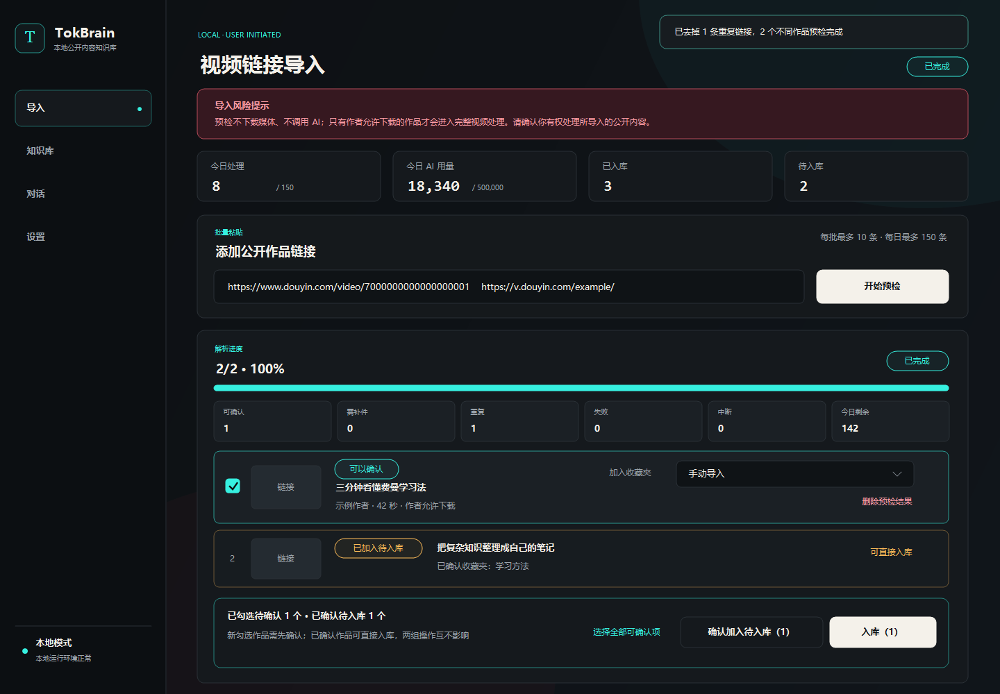
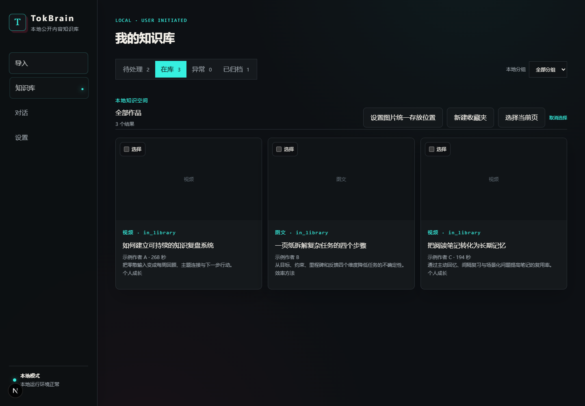
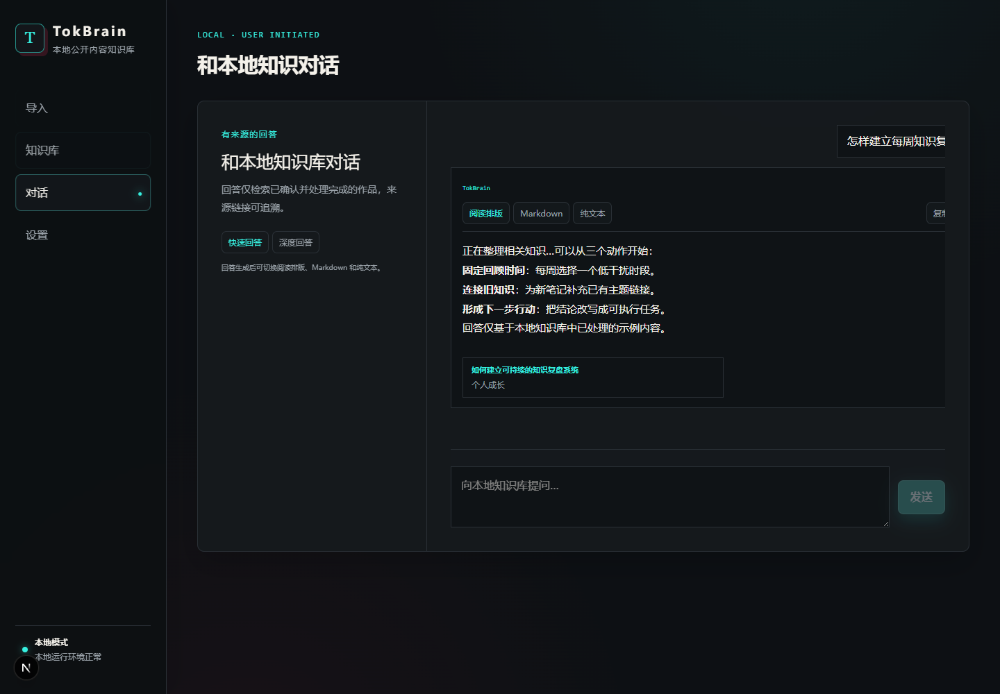
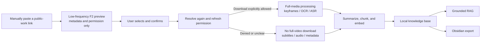

<div align="center">
  <h1>TokBrain</h1>
  <p><strong>Turn Douyin public works you are authorized to process into a searchable, traceable local multimodal knowledge base.</strong></p>
  <p>Manual link preview · Permission-aware media handling · Keyframes / OCR / ASR · AI summaries · Grounded RAG · Obsidian export</p>
  <p><a href="README.md">简体中文</a> · <strong>English</strong></p>
  <p>
    
    
    
    <a href="LICENSE"></a>
  </p>
</div>

TokBrain is for people who want to reuse knowledge contained in short-form
content instead of merely keeping video files. Manually submit a public share
link, confirm the permitted processing scope, and organize titles, subtitles,
speech, on-screen text, and structured summaries into a local knowledge base.
You can then search it semantically, ask grounded questions, and export notes
to Obsidian.

The UI, SQLite database, index, and derived knowledge stay on your computer.
Link resolution and AI processing require network access. The current release
supports Windows only and is designed for one trusted user on one local
machine.

## Feature overview

| Capability | What it does |
|---|---|
| Manual link import | Extracts, normalizes, and deduplicates public-work links from share text; accepts at most 10 per batch |
| Permission-aware preview | Reads basic metadata and author download permission first; preview does not download media or call AI |
| Multimodal processing | Runs speech transcription, keyframe extraction, OCR, summarization, chunking, and embedding on permitted media |
| Restricted-media path | When download is denied or unclear, never downloads the full video or extracts frames; tries subtitles, an independent audio candidate, or metadata |
| Local supplements | Accepts video or image files you are entitled to use and validates their real format before processing |
| Local library | Manages pending, indexed, failed, and archived works with user-created local collections |
| Grounded RAG | Offers fast and deep modes, with answers linked back to local summaries and public sources |
| Summaries and export | Creates structured highlights and exports Markdown plus local images to Obsidian |
| Cost and health controls | Shows local estimates, optional official billing, daily limits, job status, and environment checks |
| Personalization | Includes 13 local themes with adjustable background intensity |

## Screenshots

Every screenshot below uses synthetic data. No real creator content, account,
Cookie, secret, or user data is included.

### Link preview and processing policy



The import page makes batch limits, daily usage, preview status, and the media
policy visible. A work enters processing only after the user selects and
confirms it.

<table>
  <tr>
    <td width="50%">
      
    </td>
    <td width="50%">
      
    </td>
  </tr>
  <tr>
    <td align="center"><strong>Local knowledge library</strong><br>States, local collections, summaries, and Obsidian export.</td>
    <td align="center"><strong>Grounded chat</strong><br>Answers over indexed content with visible knowledge sources.</td>
  </tr>
</table>

## From a public work to local knowledge



| Input state | TokBrain behavior | Media retention |
|---|---|---|
| Download explicitly allowed | Temporarily downloads video for ASR, keyframes, and OCR; downloads a bounded set of images for image posts | Deletes the temporary full video; retains derived knowledge, keyframes, and required image assets |
| Download denied or unknown | Never downloads the full video or extracts frames; tries subtitles, an independent audio candidate, and finally basic metadata | Subtitle and audio inputs are temporary and deleted after processing |
| User-supplied local assets | Validates magic bytes, image/video structure, and size before the full local-media path | Retains source assets until the corresponding work is permanently deleted |

A successful preview only adds a work to the confirmation area. It does not
download media, call a model, or make the work searchable. TokBrain resolves
the work again before ingestion; if permission changes, the processing scope
is narrowed.

> “Author allows download” is only a technical routing signal. It is not
> permission to republish, redistribute, commercialize, train a public model
> on, or otherwise reuse the creator's content.

## Quick start

### Requirements

| Item | Requirement |
|---|---|
| Operating system | Windows; secret protection depends on Windows DPAPI |
| Python | 3.12 |
| Node.js | 22 or later |
| FFmpeg / ffprobe | Required for full-video processing and local-video validation; must be on `PATH` |
| Alibaba Cloud Model Studio API key | Required for OCR, ASR, summaries, embeddings, and chat; not required for basic preview |

`setup.cmd` installs project dependencies; it does not install system software
such as Python or Node.js. Before the first run, install **64-bit Python 3.12**
and **Node.js 22 or later**. Select `Add python.exe to PATH` in the Python
installer. If a prerequisite is missing or incompatible, the setup window now
shows the relevant download address and instructions.

### Download and run

```powershell
git clone https://github.com/fyfsxkh/TokBrain.git
cd TokBrain
.\setup.cmd
.\start.cmd
```

If you use GitHub's **Download ZIP**, extract it, open PowerShell in the project
directory, and run the last two commands. A first-time user can also
double-click `setup.cmd`; it applies an execution-policy override only to that
installer process. After setup, you can use:

- `setup.cmd` to install or update dependencies
- `启动.cmd` to start
- `停止.cmd` to stop
- `重启.cmd` to restart

When ready, TokBrain opens <http://127.0.0.1:3000>. The backend is fixed to
`http://127.0.0.1:8000`, and logs are written under `data/logs/`.

### First use

1. Open Settings and save a Model Studio API key. Add the optional F2 Cookie
   only when anonymous resolution is unreliable.
2. Open Import and paste one or more public-work links that you are authorized
   to access and process.
3. Wait for the bounded preview and check the permission and processing policy
   shown for each result.
4. Select and confirm the desired results. Preview itself consumes no AI quota.
5. Review summaries in the Library or ask questions over indexed works in Chat.

See the Chinese [user guide](操作说明书.md) for error codes, local supplements,
backup, and recovery details.

<details>
<summary><strong>Manual dependency installation</strong></summary>

The project PowerShell scripts include a UTF-8 BOM for compatibility with
Windows PowerShell 5.1.

```powershell
py -3.12 -m venv .venv
.\.venv\Scripts\python.exe -m pip install -r requirements.txt
.\.venv\Scripts\python.exe -m pip install --no-deps --target .vendor -r requirements-f2.txt
cd frontend
npm ci
cd ..
.\start.ps1
```

F2 is installed in the ignored `.vendor/` directory. Compatible runtime
dependencies are managed separately in `requirements.txt`.

</details>

## Cost and data destinations

TokBrain charges no subscription fee; repository code is provided under the
MIT License. Actual cost comes from your cloud-model usage, network, and local
compute:

| Stage | Potential cost | Data destination |
|---|---|---|
| F2 link preview | F2 is a third-party dependency; users must evaluate platform access risks and costs | Public links and an optional Cookie participate in non-official platform requests |
| OCR / ASR / summary / embedding / chat | Alibaba Cloud Model Studio normally bills by model, tokens, or audio duration | Required images, audio, text, and chat context are sent to Model Studio |
| Official bill query | Optional and not required for core features | Read-only BSS credentials call the Alibaba Cloud billing API |
| SQLite, index, summaries, keyframes | No project charge | Stored under the local `data/` directory |

In-app figures are conservative estimates based on a fixed price snapshot.
They do not deduct free quotas, promotions, cache discounts, or later price
changes. Treat the official
[Model Studio pricing page](https://help.aliyun.com/zh/model-studio/model-pricing)
and [bill](https://help.aliyun.com/zh/model-studio/bill-query-and-cost-management)
as authoritative. Settings include daily media, daily AI-token, and monthly
cost warning controls.

## Data, backups, and upgrades

- Main database: `data/douyin_rag.db`
- User-supplied assets: `data/source-assets/`
- Retained image assets: `data/media/`
- Video keyframes: `data/keyframes/`
- Automatic upgrade backups: `data/backups/`

Remote full videos are temporary processing inputs, not a permanent download
library. Permanently deleting a work also removes associated local assets.
Back up the database and asset directories from the same point in time.

On the first v4 start, TokBrain creates a SQLite backup before transactionally
migrating historical works, summaries, chunks, keyframes, usage, and local
collections. Restarting the app never resumes abandoned platform access or
processing jobs automatically.

## Development and verification

Stack:

- FastAPI, SQLAlchemy, and SQLite
- Next.js, React, and TypeScript
- F2 at a pinned version, installed in isolation
- FFmpeg / ffprobe
- Alibaba Cloud Model Studio / DashScope

```powershell
.\.venv\Scripts\python.exe -m pytest -q
cd frontend
npm test
npm run lint
npm run build
```

Tests use synthetic fixtures and mocked transports; they do not access real
Douyin endpoints. Before a release, run:

```powershell
.\scripts\prepublish_check.ps1 -Full
```

Project documents:

- [Third-party notices / 第三方软件声明](THIRD_PARTY_NOTICES.md)
- [Security policy / 安全策略](SECURITY.md)
- [Contributing / 贡献指南](CONTRIBUTING.md)
- [MIT License](LICENSE) and [Chinese reference translation](LICENSE.zh-CN)

## ⚠️ Risk, compliance, and security boundaries — read before use

### Important risks and disclaimer

1. This project is intended for technical learning and research through
   deliberate, manual testing on a personal local machine. It is not an
   official Douyin product and is not authorized by Douyin or ByteDance.
2. F2 provides non-official short-video link resolution. Platform terms may
   restrict unauthorized reverse engineering, automated requests, crawling,
   and simulated downloads. Users must assess account bans, invalid Cookies,
   IP restrictions, CAPTCHA, device controls, and enforcement risks.
3. The supported use is manually submitting a small number of public links
   that you are authorized to access and process. Without the necessary
   authorization, do not use TokBrain or a derivative for bulk collection,
   account/favorites scraping, control bypass, a public resolver API,
   commercial data services, or conduct that violates platform rules or
   third-party rights.
4. Rights in posts, images, audio, video, subtitles, and text remain with their
   creators or other rightsholders. Without explicit permission or another
   lawful basis, do not republish, redistribute, publicly communicate,
   commercialize, or build a public training dataset from that content.
5. TokBrain binds to `127.0.0.1` only. Do not expose it through a LAN, public
   Internet, reverse proxy, tunnel, or multi-user environment; those uses need
   separate authentication, security design, and legal review.
6. Users are responsible for their input, access method, purpose, and content
   use. To the extent permitted by law, users bear consequences such as account
   bans, complaints, data exposure, copyright disputes, civil claims, and
   other loss. The software is provided “as is” under the MIT License.
7. Do not make high-frequency or large-scale requests. Built-in safeguards
   reduce risk only; they do not constitute platform authorization or ensure
   that controls will not be triggered.
8. If you do not understand and accept these boundaries, do not use TokBrain
   to access a platform or process content, and remove any generated runtime
   data.

### Fixed security boundaries

- At most 10 links per batch and 150 F2 single-work resolutions per Shanghai
  calendar day.
- Three workers schedule local tasks; platform and public-media network stages
  remain globally serialized at concurrency 1.
- A randomized 4–8 second cooldown follows each access; timeouts and 5xx errors
  are retried at most once.
- A 403, 429, or risk-verification response stops later access in the batch and
  persists a 30-minute circuit breaker.
- Download permission is fail-closed: only an explicit allow signal enters the
  full-media path.
- Short links and media URLs validate HTTPS, host, port, DNS, private addresses,
  and redirect count at every hop.
- There is no automatic login, browser-Cookie extraction, account/favorites
  scan, CAPTCHA bypass, or risk-control bypass.
- Secrets and the optional Cookie are encrypted with Windows DPAPI and bound to
  the current Windows user.

### Open source and compliance

TokBrain is not affiliated with or endorsed by Douyin, ByteDance, F2, Alibaba
Cloud, or any creator. The MIT License grants rights to use, modify, and
distribute this repository's software code only. It grants no platform access
and no copyright or other license to creator content.

These risk notices and maintenance boundaries are not additional conditions on
the MIT License. MIT still permits software use, modification, distribution,
and commercial use, but every deployment must separately comply with platform
terms, third-party dependency licenses, content rights, and applicable law. A
disclaimer is not a substitute for platform authorization, rightsholder
permission, or professional legal advice.
