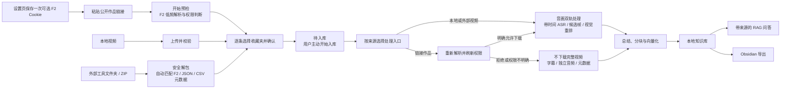

<div align="center">
  <h1>TokBrain</h1>
  <p><strong>把你有权处理的抖音公开作品，整理成可检索、可追溯的本地多模态知识库。</strong></p>
  <p>链接预检 / 本地视频 / 文件夹与 ZIP 数据包 · 关键帧 / OCR / ASR · AI 总结 · RAG 问答 · Obsidian 导出</p>
  <p><strong>简体中文</strong> · <a href="README.en.md">English</a></p>
  <p>
    
    
    
    <a href="LICENSE"></a>
  </p>
</div>

TokBrain 面向希望“复用作品中的知识”，而不是单纯保存视频文件的个人用户。用户可以
粘贴公开作品链接进行预检，也可以把其他工具已经取得的视频文件夹或 ZIP 直接交给网页
自动识别。所有预检结果都先由用户逐条确认，再进入待入库；不会因为检测完成而自动产生
AI 费用。同机外部批次接口仍保留给需要程序化接入的高级工具。确认处理范围后，标题、字幕、语音、画面文字和
结构化总结会被整理到本机知识库，再通过语义检索、带来源问答和 Obsidian 导出继续使用。

应用界面、SQLite 数据库、索引和派生知识保存在本机；链接解析和 AI 处理需要联网。
当前版本仅支持 Windows，并按单机、单用户、可信本地环境设计。

> 当前版本：**v1.0.0**（数据库 **schema v9** / **API contract 7**）
> 最新正式版：**v1.0.0**（2026-08-11） · [查看更新日志](CHANGELOG.md) ·
> [查看 GitHub Release](https://github.com/fyfsxkh/TokBrain/releases/tag/v1.0.0)

## 功能一览

| 能力 | 作用 |
|---|---|
| 链接预检 | 粘贴分享文本后解析并展示结果；每批最多 10 条，必须手工确认加入待入库，再由用户主动入库 |
| 本地视频导入 | 一次选择或拖入最多 10 个本地视频，一文件一作品；校验后进入与链接视频相同的多模态流程 |
| 外部视频数据包 | 网页可直接选择其他工具的下载文件夹或 ZIP，最多识别 100 个视频；自动读取 F2 数据库、JSON、CSV 和文件名 |
| 高级外部批次导入 | 同机工具通过 Bearer 令牌提交清单、逐文件上传并提交批次；每批最多 100 条，不是普通用户的日常导入路径 |
| 权限感知解析 | 先读取基础信息和作者下载权限；仅加入待入库时不下载媒体、不调用 AI |
| 多模态处理 | 对允许处理的媒体执行语音转写、关键帧提取、OCR、总结、分块与向量化 |
| 受限媒体流程 | 未允许下载或权限不明确时，不下载完整视频、不抽帧，只尝试字幕、独立音频候选或基础信息 |
| 本地补件 | 可上传本人有权使用的视频或图片，验证真实格式后继续处理 |
| 本地知识库 | 管理待处理、已入库、异常和归档作品，并使用自定义本地收藏夹整理 |
| 有来源的 RAG 问答 | 提供快速/深度两种模式，回答可回到本地摘要与原始公开来源 |
| 总结与导出 | 生成结构化作品精华，并可将 Markdown 与本地图片导出到 Obsidian |
| 费用与运行状态 | 展示本地估算、可选官方账单、每日额度、处理任务和环境检查 |
| 个性化界面 | 内置 13 套本地主题，可调背景显现度，不影响处理结果 |

## 界面预览

以下截图全部使用人工构造的示例数据，不包含真实作品、作者、Cookie、密钥或用户数据。

### 链接预检与手工确认


导入页会明确显示批量上限、当日用量、解析状态和媒体处理策略。链接只负责预检；预检后
用户选择收藏夹并确认加入待入库，随后再主动点击入库。网页还提供“外部视频数据包”卡片，
选择文件夹或 ZIP 后自动完成文件校验、元数据匹配与预检，同样不会自动确认或启动 AI。

<table>
  <tr>
    <td width="50%">
      
    </td>
    <td width="50%">
      
    </td>
  </tr>
  <tr>
    <td align="center"><strong>本地知识库</strong><br>分状态管理、收藏夹整理、总结与 Obsidian 导出。</td>
    <td align="center"><strong>带来源问答</strong><br>基于已入库内容回答，并展示对应知识来源。</td>
  </tr>
</table>

## 视频解析与知识入库流程



| 输入状态 | TokBrain 的处理方式 | 媒体保存方式 |
|---|---|---|
| 作者明确允许下载 | 视频并行执行带时间 ASR 和混合候选抽帧，再按语音视觉需求、OCR、画面描述、清晰度与时间覆盖重排；图文按限制下载图片并 OCR | 临时完整视频处理后删除；保留知识结果、最终关键帧及必要图文资产 |
| 作者禁止下载或权限未知 | 不下载完整视频、不抽帧；依次尝试字幕、独立音频候选，最后退化为标题、简介和作者信息 | 字幕与独立音频仅作临时输入，处理后删除 |
| 用户提供本地补件 | 验证文件魔数、图片/视频结构和大小后，按本地素材进入完整流程 | 源文件保留到对应作品被永久删除 |
| 本地视频或外部工具上传 | 验证文件真实类型、视频轨、大小和时长后直接进入完整流程；不会访问 F2 | 源文件保留到对应作品被永久删除 |

应用内链接只完成去重和预检，不会自动确认或创建 AI 任务。用户确认加入待入库后，仍需
主动点击入库。正式处理前会依据最新权限决定处理范围；如果权限发生变化，范围会随之收窄。

本地视频和外部批次在上传时已经完成文件校验，无需 F2 链接解析；对应作品使用 `never`
刷新策略，入库时直接复用已保存的本地源文件。

> “作者允许下载”只是本项目决定技术处理范围的信号，不等于作者授予转载、再分发、
> 商用、公开训练或其他内容使用许可。

## 快速开始

### 环境要求

| 项目 | 要求 |
|---|---|
| 操作系统 | Windows；密钥保护依赖 Windows DPAPI |
| Python | 3.12 |
| Node.js / npm | Node.js 22 或更高版本；npm 10 或更高版本 |
| FFmpeg / ffprobe | 完整视频处理和本地视频校验需要，并应加入 `PATH` |
| 阿里云百炼 API Key | OCR、ASR、总结、向量化和问答需要；仅解析链接并加入待入库时可暂不配置 |

`安装.cmd` 负责安装项目依赖，不会代替用户安装 Python、Node.js 等系统软件。首次
使用前请先安装 **64 位 Python 3.12** 和 **Node.js 22 或更高版本**；安装 Python
时请勾选 `Add python.exe to PATH`。如果缺少或版本不符合，安装窗口会给出对应下载
地址和处理方法，不会再显示难以理解的 PowerShell 异常。

### 下载并启动

```powershell
git clone https://github.com/fyfsxkh/TokBrain.git
cd TokBrain
.\setup.cmd
.\start.cmd
```

如果使用 GitHub 的 **Download ZIP**，解压后在项目目录打开 PowerShell，执行最后两条
命令即可；零基础用户也可以直接双击 `安装.cmd`，无需永久修改 PowerShell 执行策略。
安装完成后，日常可直接双击：

- `安装.cmd`：首次安装或更新依赖
- `启动.cmd`
- `停止.cmd`
- `重启.cmd`

三个入口共用同一份 `data/runtime.json` 状态：启动会在确认相关端口空闲后自动清理失效
状态；停止兼容旧启动器状态，但只有记录 PID、监听端口和 TokBrain 服务特征同时匹配时
才会终止旧进程；重启严格复用“停止成功后再启动”的相同流程，不会按端口盲目关闭其他软件。

服务就绪后会打开 <http://127.0.0.1:3000>，前端始终只监听本机 3000 端口。后端读取
`.env` 中的 `APP_HOST` / `APP_PORT`（默认 `127.0.0.1:8000`）。这两个值改变后必须重新
运行 `安装.cmd`，让生产前端使用同一个 API 地址。运行日志位于 `data/logs/`。

### 第一次使用

1. 打开“设置”，保存百炼 API Key。如匿名解析不稳定，可在这里保存一次可选 F2
   Cookie；此后应用会加密复用，不需要每次导入重新输入。
2. 回到“导入”，粘贴公开作品链接并点击“开始预检”。
3. 预检完成后逐条选择收藏夹，点击“确认加入待入库”；需要处理时再点击“入库”。
4. 已用 F2 或其他工具下载好视频时，可在“外部视频数据包”选择整个文件夹或 ZIP；网页会
   自动识别元数据。识别不到元数据的文件会按文件名和 SHA-256 作为本地视频继续导入。
5. 也可以选择“本地视频”，拖入最多 10 个有权处理的视频，并按页面提示完成校验与确认。
6. 在“知识库”查看总结，或在“对话”中基于已入库内容提问。选择某个收藏夹后可为其
   设置专属总结提示词；未设置时使用设置页的全局提示词。

普通用户无需运行 F2 CLI、制作 manifest、生成外部导入令牌或执行推送脚本。只有需要让
同机自有工具程序化推送最多 100 个本地视频时，才使用
[高级外部批量导入 API v1](docs/external-import-v1.md)。

页面切换不会清空已经完成的链接导入结果；批次结果可单独清理。知识库中的待入库、
已入库、异常和归档作品都可以永久删除，已经生成的总结、索引及本地资产会同步清理。

完整操作、错误码、本地补件、备份与恢复说明见
[《操作说明书》](操作说明书.md)。

<details>
<summary><strong>手动安装依赖</strong></summary>

为避免旧虚拟环境残留依赖，受支持的安装方式统一由安装脚本完成。它会在临时目录创建
干净的 Python 3.12 环境，执行 `pip check`、验证 F2 确实来自 `.vendor/`、运行 `npm ci`
并生成 Next.js 生产构建；全部成功后才切换 Python 环境。Windows PowerShell 5.1 能
正确读取已带 UTF-8 BOM 的项目脚本。

```powershell
.\scripts\setup.ps1
# 开发/测试环境额外安装 requirements-dev.txt：
.\scripts\setup.ps1 -WithDev
```

主运行依赖、可选账单依赖、开发工具和 F2 包分别位于 `requirements.txt`、
`requirements-billing.txt`、`requirements-dev.txt` 与 `requirements-f2.txt`。F2 被
隔离安装到 Git 忽略的 `.vendor/`；如不使用账单核对，可传入 `-WithoutBilling`。

</details>

## 费用与数据去向

TokBrain 本身不收取订阅费，仓库代码按 MIT License 提供。实际使用成本来自你选择的
云模型服务、网络和本机资源：

| 环节 | 是否可能收费 | 数据去向 |
|---|---|---|
| F2 链接解析 | F2 本身为第三方依赖；平台访问风险与费用由使用者自行确认 | 公开链接及可选 Cookie 会参与非官方平台请求 |
| OCR / ASR / 总结 / 向量 / 问答 | 阿里云百炼通常按模型、Token 或音频时长计费 | 所需图片、音频、文本和问答上下文会发送到百炼 |
| 官方账单查询 | 可选，不影响核心功能 | 只读 BSS AccessKey 用于调用阿里云账单接口 |
| SQLite、索引、摘要、关键帧 | 项目不收费 | 保存在本机 `data/` 目录 |

应用内费用数字是根据固定价格快照计算的保守估算，不扣除免费额度、活动优惠、缓存
折扣或后续价格变化；最终以
[阿里云百炼模型价格](https://help.aliyun.com/zh/model-studio/model-pricing)和
[正式账单](https://help.aliyun.com/zh/model-studio/bill-query-and-cost-management)
为准。设置页可配置每日媒体分钟、每日 AI Token 和月度费用预警。

## 数据、备份与更新

- 主数据库：`data/douyin_rag.db`
- 本地视频与补件源文件：`data/source-assets/`
- 处理后的图文资产：`data/media/`
- 视频关键帧：`data/keyframes/`
- 自动升级备份：`data/backups/`

完整远程视频只作为临时处理输入，不作为视频下载库长期保存。永久删除作品时会同步清理
关联本地资产；手动备份时应让数据库和资产目录保持同一时间点。

当前开发版使用 **schema v9**。从旧结构首次启动时，程序会先在 `data/backups/` 创建
`douyin_rag-pre-v9-*.db`，再迁移历史作品、总结、知识块、关键帧、用量和本地收藏夹；
从 schema v4 升级仍会保留已有链接导入与入库队列。

schema v9 会为受限视频补充证据/补件状态。若一条已入库受限视频既没有本地源文件，也
没有字幕、转写、OCR 或视觉描述等原始证据，迁移会把它标记为“证据不足/需要补件”，并
清除可能误导检索的正文、总结、知识块和关键帧。需要找回迁移前内容时，应先停止服务，
再从对应 `pre-v9` 数据库与同一时间点的资产备份恢复。应用重启不会自动恢复遗留的平台
访问或处理任务。

处理结果保存使用“数据库事务 + 文件代际”一起收口：新媒体和关键帧先写入暂存代际，旧
代际会保留到数据库提交成功后才清理。若提交失败或任务在提交前被取消，数据库会回滚并
恢复旧文件代际。预算预留也会按实际结果结算：尚未调用模型的部分释放，已经发生的模型
调用仍按真实用量记录；异常退出遗留的预留会在处理协调器下次启动时回收。遇到
`persistence_failed` 时先检查磁盘、数据库和设置页的后台协调器状态，再重试任务，不要在
任务运行期间手工移动 `data/media/` 或 `data/keyframes/`。

## 开发与验证

技术栈：

- FastAPI、SQLAlchemy、SQLite
- Next.js、React、TypeScript
- F2（固定版本、隔离安装）
- FFmpeg / ffprobe
- 阿里云百炼 DashScope

```powershell
.\scripts\setup.ps1 -WithDev
.\.venv\Scripts\python.exe -m pytest -q
.\.venv\Scripts\python.exe scripts\audit_library.py --json
cd frontend
npm test
npm run lint
npm run typecheck
npm run build
```

测试使用人工构造数据和模拟传输层，不访问真实抖音。发布前可运行：

```powershell
.\scripts\prepublish_check.ps1 -Full -RequireClean
```

`-RequireClean` 要求发布目标已经提交且工作区无未跟踪文件，避免本机可运行但源码归档缺少
核心文件。CI 还通过正式 `setup.ps1 -WithDev` 路径安装、检查 Python 覆盖率下限，并验证
FFmpeg、依赖冲突、F2 来源、前端测试/lint、严格 TypeScript typecheck（包含未使用声明）、
生产构建和发布候选文件。启动脚本还会在打开页面前确认链接预检、数据包导入和本地处理
三个后台协调器都存活。

项目文档：

- [更新日志 / Changelog](CHANGELOG.md)
- [高级集成：外部批量导入 API v1](docs/external-import-v1.md)
- [最新 GitHub Release](https://github.com/fyfsxkh/TokBrain/releases/tag/v1.0.0)
- [第三方软件声明 / Third-party notices](THIRD_PARTY_NOTICES.md)
- [安全策略 / Security policy](SECURITY.md)
- [贡献指南 / Contributing](CONTRIBUTING.md)
- [MIT License](LICENSE) 与[中文参考译文](LICENSE.zh-CN)

## ⚠️ 风险、合规与安全边界【必读】

### 重要风险与免责声明

1. 本项目仅面向技术学习与研究，适用于个人在本地环境中主动、手动测试；它不是抖音
   官方工具，也未获得抖音或字节跳动授权。
2. 项目依赖 F2 实现短视频链接解析，其中包含非官方请求机制。平台用户协议可能限制
   未经授权的逆向工程、自动化请求、爬虫和模拟下载。使用者必须自行评估账号封禁、
   Cookie 失效、IP 限制、验证码、设备风控和平台追责等风险。
3. 项目支持在本人本地环境中手动粘贴少量、本人有权访问和处理的链接。不得在未取得
   必要授权时将本项目或其衍生项目用于批量采集、账号/收藏夹抓取、规避风控、公网
   解析 API、商业数据服务或其他违反平台规则、侵犯第三方权益的行为。
   外部导入接口只用于接收调用方已经合法取得的本地视频和元数据，不提供、授权或鼓励
   任何采集能力。
4. 通过本工具处理的图文、图片、音频、视频、字幕和文案，其权利仍归原创作者或其他
   权利人所有。除非已经取得明确授权或具有其他合法依据，不得转载、再分发、公开传播、
   用于商业项目或制作公开训练数据集。
5. 项目默认仅监听 `127.0.0.1`。不要通过局域网、公网、反向代理、隧道或多用户环境
   暴露服务；这类部署需要独立的身份认证、安全设计和法律审查。
6. 使用者应对自己的输入、访问方式、处理目的和内容使用行为负责。在适用法律允许的
   范围内，因使用本项目产生的账号封禁、平台投诉、数据泄露、版权争议、民事纠纷或
   其他损失与责任，由使用者自行承担；软件按 MIT License 的“原样”条款提供。
7. 请勿高频或大规模发起请求。内置限制只能降低风险，不能代表平台授权，也不能保证
   不会触发风控。
8. 如不能理解、接受并遵守上述边界，请勿使用本项目访问平台或处理内容，并清理已经
   产生的运行数据。

### 固定安全边界

- 链接批次每批最多 10 条、每个上海自然日最多 150 次 F2 单作品解析。
- 本地界面每批最多 10 个视频；同机外部清单每批最多 100 条，二者均不访问平台。
- 三个 worker 只负责任务调度；平台解析和公开媒体网络阶段全局并发始终为 1。
- 每条访问后随机冷却 4–8 秒；网络超时或 5xx 最多重试一次。
- 403、429 或风险验证会终止当前批次的后续访问，并持久化熔断 30 分钟。
- 下载权限采用失败关闭策略：只有明确允许才进入完整媒体流程。
- 短链和媒体地址逐跳校验 HTTPS、域名、端口、DNS、私网地址和重定向次数。
- 不提供自动登录、浏览器 Cookie 提取、账号/收藏夹扫描、验证码绕过或风控绕过。
- 外部导入不接受远程媒体 URL、任意本机路径或无视频的纯元数据记录，且接口只监听本机。
- 密钥和可选 Cookie 使用 Windows DPAPI 绑定当前 Windows 用户加密保存。

### 开源与合规

TokBrain 与抖音、字节跳动、F2、阿里云及任何内容创作者均无隶属、合作或背书关系。
MIT License 只授权使用、修改和分发本仓库的软件代码，不授权访问第三方平台，也不
授予任何作品内容的版权或其他使用许可。

上述风险提示和维护边界不是对 MIT License 的附加许可证条件。MIT 仍允许对代码进行
使用、修改、分发和商业利用；但任何使用方式都必须另行遵守平台协议、第三方依赖许可、
内容权利和适用法律。免责声明不能替代平台授权、权利人许可或专业法律意见。
