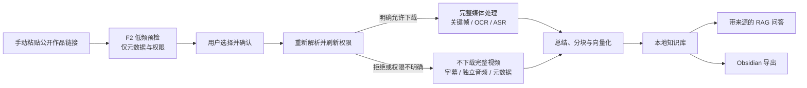

<div align="center">
  <h1>TokBrain</h1>
  <p><strong>把你有权处理的抖音公开作品，整理成可检索、可追溯的本地多模态知识库。</strong></p>
  <p>手动链接预检 · 权限感知媒体处理 · 关键帧 / OCR / ASR · AI 总结 · RAG 问答 · Obsidian 导出</p>
  <p><strong>简体中文</strong> · <a href="README.en.md">English</a></p>
  <p>
    
    
    
    <a href="LICENSE"></a>
  </p>
</div>

TokBrain 面向希望“复用作品中的知识”，而不是单纯保存视频文件的个人用户。你可以
手动粘贴公开作品分享文本，在确认处理范围后，将标题、字幕、语音、画面文字和结构化
总结整理到本机知识库，再通过语义检索、带来源问答和 Obsidian 导出继续使用。

应用界面、SQLite 数据库、索引和派生知识保存在本机；链接解析和 AI 处理需要联网。
当前版本仅支持 Windows，并按单机、单用户、可信本地环境设计。

## 功能一览

| 能力 | 作用 |
|---|---|
| 手动链接导入 | 从分享文本中提取、清理并去重公开作品链接；每批最多接收 10 条 |
| 权限感知预检 | 先读取基础信息和作者下载权限；预检阶段不下载媒体、不调用 AI |
| 多模态处理 | 对允许处理的媒体执行语音转写、关键帧提取、OCR、总结、分块与向量化 |
| 受限媒体流程 | 未允许下载或权限不明确时，不下载完整视频、不抽帧，只尝试字幕、独立音频候选或基础信息 |
| 本地补件 | 可上传本人有权使用的视频或图片，验证真实格式后继续处理 |
| 本地知识库 | 管理待处理、已入库、异常和归档作品，并使用自定义本地收藏夹整理 |
| 有来源的 RAG 问答 | 提供快速/深度两种模式，回答可回到本地摘要与原始公开来源 |
| 总结与导出 | 生成结构化作品精华，并可将 Markdown 与本地图片导出到 Obsidian |
| 费用与运行状态 | 展示本地估算、可选官方账单、每日额度、处理任务和环境检查 |
| 个性化界面 | 内置 13 套本地主题，可调背景显现度，不影响处理结果 |

## 界面预览

以下截图全部使用人工构造的示例数据，不包含真实作品、作者、Cookie、密钥或用户数据。

### 链接预检与处理分流


导入页会明确显示批量上限、当日用量、解析状态和媒体处理策略。只有用户勾选并确认后，
作品才会进入后续处理。

<table>
  <tr>
    <td width="50%">
      
    </td>
    <td width="50%">
      
    </td>
  </tr>
  <tr>
    <td align="center"><strong>本地知识库</strong><br>分状态管理、收藏夹整理、总结与 Obsidian 导出。</td>
    <td align="center"><strong>带来源问答</strong><br>基于已入库内容回答，并展示对应知识来源。</td>
  </tr>
</table>

## 视频解析与知识入库流程



| 输入状态 | TokBrain 的处理方式 | 媒体保存方式 |
|---|---|---|
| 作者明确允许下载 | 视频执行临时下载、ASR、关键帧和 OCR；图文按限制下载图片并 OCR | 临时完整视频处理后删除；保留知识结果、关键帧及必要图文资产 |
| 作者禁止下载或权限未知 | 不下载完整视频、不抽帧；依次尝试字幕、独立音频候选，最后退化为标题、简介和作者信息 | 字幕与独立音频仅作临时输入，处理后删除 |
| 用户提供本地补件 | 验证文件魔数、图片/视频结构和大小后，按本地素材进入完整流程 | 源文件保留到对应作品被永久删除 |

预检成功只表示作品可以进入“待确认”区域，不代表已经下载媒体、调用模型或加入可检索
知识库。确认入库前会再次刷新作品信息；如果权限发生变化，处理范围会随之收窄。

> “作者允许下载”只是本项目决定技术处理范围的信号，不等于作者授予转载、再分发、
> 商用、公开训练或其他内容使用许可。

## 快速开始

### 环境要求

| 项目 | 要求 |
|---|---|
| 操作系统 | Windows；密钥保护依赖 Windows DPAPI |
| Python | 3.12 |
| Node.js | 22 或更高版本 |
| FFmpeg / ffprobe | 完整视频处理和本地视频校验需要，并应加入 `PATH` |
| 阿里云百炼 API Key | OCR、ASR、总结、向量化和问答需要；仅做基础预检时可暂不配置 |

### 下载并启动

```powershell
git clone https://github.com/fyfsxkh/TokBrain.git
cd TokBrain
.\scripts\setup.ps1
.\start.ps1
```

如果使用 GitHub 的 **Download ZIP**，解压后在项目目录打开 PowerShell，执行最后两条
命令即可。安装完成后，日常可直接双击：

- `启动.cmd`
- `停止.cmd`
- `重启.cmd`

服务就绪后会打开 <http://127.0.0.1:3000>。后端固定使用
`http://127.0.0.1:8000`，运行日志位于 `data/logs/`。

### 第一次使用

1. 打开“设置”，保存百炼 API Key；只有匿名解析不稳定时才考虑手动填写可选 F2
   Cookie。
2. 回到“导入”，粘贴一条或多条本人有权访问和处理的公开作品链接。
3. 等待低频预检，核对每条作品的权限状态和处理方式。
4. 勾选需要的结果并确认入库；预检本身不会产生 AI 用量。
5. 在“知识库”查看总结，或在“对话”中基于已入库内容提问。

完整操作、错误码、本地补件、备份与恢复说明见
[《操作说明书》](操作说明书.md)。

<details>
<summary><strong>手动安装依赖</strong></summary>

```powershell
py -3.12 -m venv .venv
.\.venv\Scripts\python.exe -m pip install -r requirements.txt
.\.venv\Scripts\python.exe -m pip install --no-deps --target .vendor -r requirements-f2.txt
cd frontend
npm ci
cd ..
.\start.ps1
```

F2 被隔离安装到 Git 忽略的 `.vendor/`，其兼容运行依赖由
`requirements.txt` 单独管理。

</details>

## 费用与数据去向

TokBrain 本身不收取订阅费，仓库代码按 MIT License 提供。实际使用成本来自你选择的
云模型服务、网络和本机资源：

| 环节 | 是否可能收费 | 数据去向 |
|---|---|---|
| F2 链接预检 | F2 本身为第三方依赖；平台访问风险与费用由使用者自行确认 | 公开链接及可选 Cookie 会参与非官方平台请求 |
| OCR / ASR / 总结 / 向量 / 问答 | 阿里云百炼通常按模型、Token 或音频时长计费 | 所需图片、音频、文本和问答上下文会发送到百炼 |
| 官方账单查询 | 可选，不影响核心功能 | 只读 BSS AccessKey 用于调用阿里云账单接口 |
| SQLite、索引、摘要、关键帧 | 项目不收费 | 保存在本机 `data/` 目录 |

应用内费用数字是根据固定价格快照计算的保守估算，不扣除免费额度、活动优惠、缓存
折扣或后续价格变化；最终以
[阿里云百炼模型价格](https://help.aliyun.com/zh/model-studio/model-pricing)和
[正式账单](https://help.aliyun.com/zh/model-studio/bill-query-and-cost-management)
为准。设置页可配置每日媒体分钟、每日 AI Token 和月度费用预警。

## 数据、备份与更新

- 主数据库：`data/douyin_rag.db`
- 本地补件：`data/source-assets/`
- 处理后的图文资产：`data/media/`
- 视频关键帧：`data/keyframes/`
- 自动升级备份：`data/backups/`

完整远程视频只作为临时处理输入，不作为视频下载库长期保存。永久删除作品时会同步清理
关联本地资产；手动备份时应让数据库和资产目录保持同一时间点。

首次启动 v4 数据结构时，程序会先创建 SQLite 备份，再事务化迁移历史作品、总结、
知识块、关键帧、用量和本地分组。应用重启不会自动恢复遗留的平台访问或处理任务。

## 开发与验证

技术栈：

- FastAPI、SQLAlchemy、SQLite
- Next.js、React、TypeScript
- F2（固定版本、隔离安装）
- FFmpeg / ffprobe
- 阿里云百炼 DashScope

```powershell
.\.venv\Scripts\python.exe -m pytest -q
cd frontend
npm test
npm run lint
npm run build
```

测试使用人工构造数据和模拟传输层，不访问真实抖音。发布前可运行：

```powershell
.\scripts\prepublish_check.ps1 -Full
```

项目文档：

- [第三方软件声明 / Third-party notices](THIRD_PARTY_NOTICES.md)
- [安全策略 / Security policy](SECURITY.md)
- [贡献指南 / Contributing](CONTRIBUTING.md)
- [MIT License](LICENSE) 与[中文参考译文](LICENSE.zh-CN)

## ⚠️ 风险、合规与安全边界【必读】

### 重要风险与免责声明

1. 本项目仅面向技术学习与研究，适用于个人在本地环境中主动、手动测试；它不是抖音
   官方工具，也未获得抖音或字节跳动授权。
2. 项目依赖 F2 实现短视频链接解析，其中包含非官方请求机制。平台用户协议可能限制
   未经授权的逆向工程、自动化请求、爬虫和模拟下载。使用者必须自行评估账号封禁、
   Cookie 失效、IP 限制、验证码、设备风控和平台追责等风险。
3. 项目支持在本人本地环境中手动粘贴少量、本人有权访问和处理的链接。不得在未取得
   必要授权时将本项目或其衍生项目用于批量采集、账号/收藏夹抓取、规避风控、公网
   解析 API、商业数据服务或其他违反平台规则、侵犯第三方权益的行为。
4. 通过本工具处理的图文、图片、音频、视频、字幕和文案，其权利仍归原创作者或其他
   权利人所有。除非已经取得明确授权或具有其他合法依据，不得转载、再分发、公开传播、
   用于商业项目或制作公开训练数据集。
5. 项目默认仅监听 `127.0.0.1`。不要通过局域网、公网、反向代理、隧道或多用户环境
   暴露服务；这类部署需要独立的身份认证、安全设计和法律审查。
6. 使用者应对自己的输入、访问方式、处理目的和内容使用行为负责。在适用法律允许的
   范围内，因使用本项目产生的账号封禁、平台投诉、数据泄露、版权争议、民事纠纷或
   其他损失与责任，由使用者自行承担；软件按 MIT License 的“原样”条款提供。
7. 请勿高频或大规模发起请求。内置限制只能降低风险，不能代表平台授权，也不能保证
   不会触发风控。
8. 如不能理解、接受并遵守上述边界，请勿使用本项目访问平台或处理内容，并清理已经
   产生的运行数据。

### 固定安全边界

- 每批最多 10 条、每个上海自然日最多 150 次 F2 单作品解析。
- 三个 worker 只负责任务调度；平台解析和公开媒体网络阶段全局并发始终为 1。
- 每条访问后随机冷却 4–8 秒；网络超时或 5xx 最多重试一次。
- 403、429 或风险验证会终止当前批次的后续访问，并持久化熔断 30 分钟。
- 下载权限采用失败关闭策略：只有明确允许才进入完整媒体流程。
- 短链和媒体地址逐跳校验 HTTPS、域名、端口、DNS、私网地址和重定向次数。
- 不提供自动登录、浏览器 Cookie 提取、账号/收藏夹扫描、验证码绕过或风控绕过。
- 密钥和可选 Cookie 使用 Windows DPAPI 绑定当前 Windows 用户加密保存。

### 开源与合规

TokBrain 与抖音、字节跳动、F2、阿里云及任何内容创作者均无隶属、合作或背书关系。
MIT License 只授权使用、修改和分发本仓库的软件代码，不授权访问第三方平台，也不
授予任何作品内容的版权或其他使用许可。

上述风险提示和维护边界不是对 MIT License 的附加许可证条件。MIT 仍允许对代码进行
使用、修改、分发和商业利用；但任何使用方式都必须另行遵守平台协议、第三方依赖许可、
内容权利和适用法律。免责声明不能替代平台授权、权利人许可或专业法律意见。
